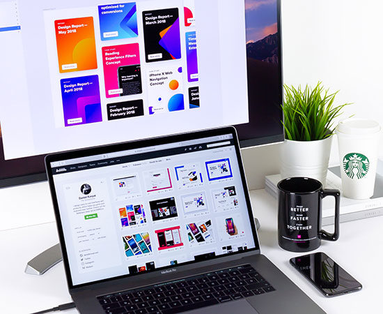

# Inventory Management System

This is a Django-based Inventory Management System for managing companies, products, and orders. The project includes user authentication, company profiles, product management, and order tracking.

## Features
- Company registration and profile management
- Product CRUD operations
- Order management
- User authentication (login/register)
- Dashboard and reporting

## Screenshots
Below are some of the main screens of the application:

| Screen                | Description                        |
|-----------------------|------------------------------------|
|  | User login page                  |
|  | Main dashboard after login        |
|  | Product management screen         |
|    | Orders management screen          |
|  | Company profile page               |

> Images are located in the `static/img/` and `static/Company_Profiles/` folders. Update the paths if you move images or use your own screenshots.

## Project Structure
- `Inventory_App/`: Main Django app containing models, views, and migrations
- `Inventory_Management_System/`: Django project settings and configuration
- `static/`: Static files (CSS, JS, images)
- `templates/`: HTML templates for the web interface
- `db.sqlite3`: SQLite database file
- `manage.py`: Django management script

## Setup Instructions
1. **Clone the repository**
2. **Install dependencies**:
   - Ensure you have Python 3.8+
   - Install Django: `pip install django`
3. **Apply migrations**:
   - `python manage.py migrate`
4. **Create a superuser**:
   - `python manage.py createsuperuser`
5. **Run the development server**:
   - `python manage.py runserver`
6. **Access the app**:
   - Open `http://127.0.0.1:8000/` in your browser

## License
This project is for educational purposes.
